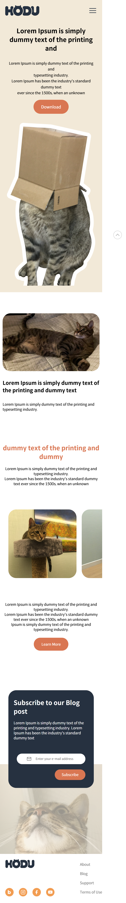

# HODU README

## HODU Landing Page

[HODU_Landing_Page 이동]
([https://chlwlsgh777.github.io/EST_Landing_Page/pages/index.html](https://chlwlsgh777.github.io/EST_Landing_Page/pages/index.html))

## 📗프로젝트 소개

HTML과 CSS를 이용하여 PC화면 구성 후 미디어 쿼리를 이용하여 390px의 소형 모바일 기기 환경에 맞는 반응형 웹으로 구성하

## 🛠기술 스텍

- HTML
- CSS

## 📌구현 요소

- 390px의 소형 모바일 기기 미디어쿼리
- 모달
- 햄버거메뉴

## 🗂 폴더 구조

```
📁 src
├─📁css
│ ├─reset.css
│ └─style.css

├─📁icon
├─📁images
├─📁pages
│ └─index.html
└[README.md](http://xn--readme-2r7c.md/)
```

## 📺완성 화면

pc 화면
-1.png>)

소형 모바일 기기 화면



## ✅프로젝트 후기

pc화면 구성하는것은 크게 어렵지않았으나 미디어 쿼리에서 overflow-y를 사용하여 해당 부분의 이미지만 스크롤 할 수있게 만들수있었다.

pc화면과 다른 메뉴들이 추가되거나 변경된 부분들이 있었고 해당 부분을 해결할속성들을 응용하는 능력이 부족하다고 깨달았다.
